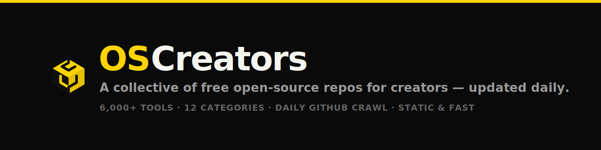
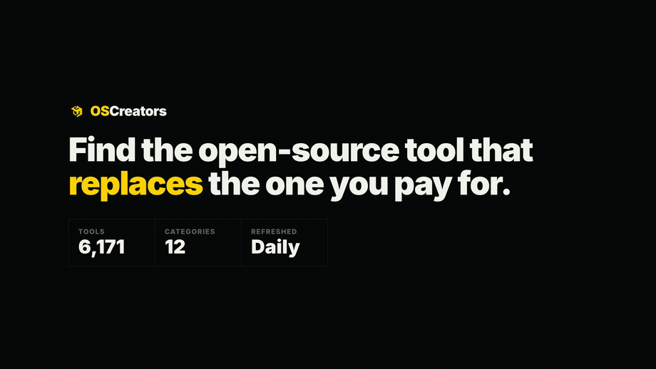

<p align="center">
  <a href="https://open-source-creators.vercel.app">
    
  </a>
</p>

<p align="center">
  <a href="https://open-source-creators.vercel.app"></a>
  <a href="LICENSE"></a>
  
  <a href="https://github.com/mostafamohamedAyoussef/Open-Source-Creators/stargazers"></a>
</p>

# Open-Source Creators

**A collective of free open-source repos for creators — updated daily.**

Open-Source Creators is a continuously-updated directory of open-source tools for content creators, marketers, filmmakers, and AI builders. It tracks open-source alternatives to commercial giants like **Midjourney, Runway, Jasper, Canva, ElevenLabs, and CapCut** — automatically crawled from GitHub, scored, categorized, and published as a fast static site every day.

### 🔗 Live: **[open-source-creators.vercel.app](https://open-source-creators.vercel.app)**

> ⭐ If this helps you discover great open-source tools, a star goes a long way.

<p align="center">
  <a href="https://open-source-creators.vercel.app">
    
  </a>
  <br>
  <em><a href="docs/demo.mp4">▶ Watch the 19s demo with sound</a> · <a href="https://open-source-creators.vercel.app">try it live</a></em>
</p>

---

## Features

- **Automated daily crawl** — a GitHub Action runs the GitHub Search API across 12 creator-focused categories (AI image/video, TTS, video editing, design, automation, 3D, and more), deduplicating by repository ID.
- **Smart scoring** — every repo is scored 1–10 from stars, update recency, description completeness, and topic coverage, with derived signals for *hidden gems* and *emerging* projects.
- **Commercial-alternative mapping** — surfaces which paid product each open-source tool can replace ("Replaces Midjourney", "Replaces CapCut", …).
- **Per-project pages** — a canonical, SEO-ready static page for every one of the ~6,000+ repositories, with facts, tags, commercial alternatives, and deterministically-ranked related projects.
- **Fast, static, dependency-light** — vanilla HTML/CSS/JS frontend; page generation uses only the Python standard library. No client framework, no database.
- **SEO built in** — per-page canonical URLs, Open Graph/Twitter tags, JSON-LD `SoftwareApplication` structured data, and a generated `sitemap.xml`.
- **Accessible & responsive** — semantic landmarks, keyboard-navigable controls, `prefers-reduced-motion`, and a black/white/yellow editorial design that works from 320px up.

## How it works

```
GitHub Search API
        │
        ▼
scripts/collector.py     → data/raw_repos.json      (crawl + dedupe by repo id)
        │
        ▼
scripts/processor.py     → data/processed_repos.json (score, categorize, map alternatives)
        │
        ▼
scripts/site_generator.py → project/<slug>/index.html + data/projects/*.json
                            + sitemap.xml + catalog-meta.json
        │
        ▼
build.py                 → dist/  (assembled static site, deployed to Vercel)
```

The whole pipeline runs daily in GitHub Actions and redeploys automatically on Vercel.

## Local development

```bash
# 1. Install Python dependencies (only the collector needs these)
pip install -r requirements.txt

# 2. Provide a GitHub token for the crawler (local .env or shell env)
echo "GITHUB_TOKEN=ghp_your_token_here" > .env

# 3. Run the pipeline
python scripts/collector.py     # crawl GitHub  → data/raw_repos.json
python scripts/processor.py     # score + build → data/processed_repos.json + site

# 4. Serve locally
python -m http.server 8000      # open http://localhost:8000
```

Run the test suite:

```bash
PYTHONPATH=. python -m unittest discover -v
```

## Deployment

The site deploys to **Vercel** from `main`. `vercel.json` runs `python3 build.py`, which assembles a clean `dist/` (static frontend + generated project pages + sitemap) that Vercel serves. Canonical URLs use Vercel's `VERCEL_PROJECT_PRODUCTION_URL` automatically, or set a `SITE_URL` variable to pin a custom domain. The generated output is rebuilt on every deploy and is not committed to git.

## Roadmap

Per-project stable IDs and JSON artifacts are intentional seams for what's next:

- [ ] **Codex-assisted PR review & release automation** in CI
- [ ] **AI-generated project summaries** (one-line "what this does / who it's for")
- [ ] Historical star-growth analytics and trending/fastest-growing views
- [ ] Semantic search over embeddings
- [ ] "Open-source alternatives to X" landing pages
- [ ] Public JSON API + MCP server for AI assistants

## Contributing

Contributions are very welcome — especially new categories, better commercial-alternative mappings, and data-quality fixes. See **[CONTRIBUTING.md](CONTRIBUTING.md)** to get started. Please also read the **[Code of Conduct](CODE_OF_CONDUCT.md)**.

## License

Released under the [MIT License](LICENSE).
